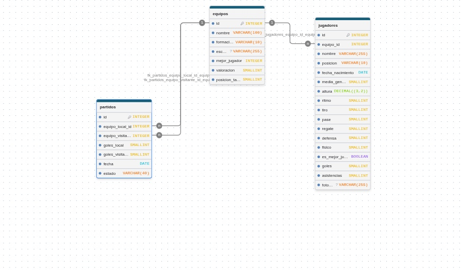

**REQUISITOS PREVIOS:**
- Docker y Docker Compose instalados y en ejecución.
- Puertos `8080` (HTTP) y `5432` (PostgreSQL) libres en el equipo.

**PARA EJECUTAR EL SERVIDOR, UTILIZAR:**
+ clonar el repositorio
+ cd Tp-ProgWeb
+ ejecutar el comando: docker compose up -d --build (en este paso, pueden comentar esta linea en docker-compose.yml en caso de que no quieran cargar los datos de prueba de equipos:"./db/test-data.sql:/docker-entrypoint-initdb.d/2_test-data.sql")
+ luego acceder desde el navegador a: http://localhost:8080

**DETALLES DE ESTA SEGUNDA PARTE:**
+ Se incorporó docker, tanto un contenedor para la aplicacion como un contenedor para la base de datos. Se pueden ver detalles acerca de como están administrados en docker-compose.yml
+ Se incorporó postgres
+ Se agregaron las entidades EQUIPO, JUGADOR y PARTIDO que son la base del proyecto
+ Se estructuró el proyecto en diferentes secciones: 
    - Por un lado esta la carpeta "db" donde se guarda todo lo relacionado a la base de datos
    - Por otro lado, se agregó la carpeta "internal" que contiene datos propios del funcionamiento interno del servidor (como los handlers de la API y el servidor de paginas HTML según la petición realizada) y los datos generados por "sqlc" para la peticiones 
    -Esta sección también cuenta con DTO's que permitieron evitar errores generados en la capa de transporte de datos, que ocasionaban conflictos de tipos con la base datos
+ Se modifico la direccion del archivo "main.go" que inicializa el servidor a la carpeta "server", además de que se mantuvo su estructura simple para que solo se encargue de iniciar la base de datos, el servidor y delegue el manejo de rutas a los Handlers
+ Se separó la logica de redireccionamiento según la petición realizada a "routes/routes.go"
+ Se agregaron un archivo "test.sh" y "Makefile" que permiten ejecutar pruebas automatizadas

**PARA EJECUTAR LAS PRUEBAS:**
- ejecutar el comando: "make test"  o "./test.sh" en bash

esta seria la estructura de la base de datos

PARA FUTURAS EDICIONES:
+ Si se nos solicita agregaremos .env y .gitignore para contraseñas y archivos que no sean necesarios
+ Reestructurar el contenido de los handlers para abstraerlos de la capa de datos y generar una capa de negocios totalmente independiente de la tecnologia (Por ejemplo, algo que siga esta estructura: Handler → Service → Repository → Database)

DETALLES DE NUESTRA PÁGINA:
Nuestra página consta de un tablero que enseña equipos cargados por el administrador, donde los usuarios que la utilicen pueden ver información acerca de los mismos. Por ejemplo, plantel, valoración media del equipo, mejores jugadores, estadísticas individuales de cada jugador, últimos resultados de ese equipo, posición en la tabla, etc.
Para ello, cada elemento tendrá:
+ Tarjeta del equipo
    Es la información resumida que se muestra en el tablero:

    -Nombre
    -Valoración media
    -Cantidad de jugadores
    -Posición en la tabla

+ Detalle del equipo
    Se muestra al hacer clic en la tarjeta del equipo:

    -Nombre
    -Formación
    -Plantel de jugadores
    -Mejor jugador
    -Valoración media
    -Últimos resultados
    -Estadísticas generales del equipo

+ Tarjeta de jugador
    Información resumida de cada jugador dentro del plantel:

    -Nombre
    -Media del jugador
    -Posición

+ Detalle del jugador
    Informacion detallada que se muestra al hacer click sobre la carta del jugador:

    -Nombre
    -Posición
    -Edad
    -Media
    -Partidos jugados
    -Goles
    -Asistencias
    -Otras estadísticas individuales (velocidad, regate, tiro, etc)